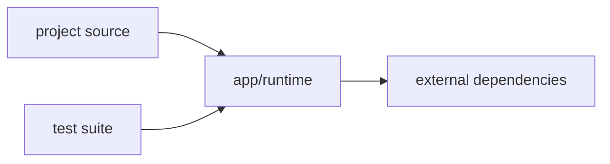

<!--
This file is generated/refreshed by the `project-scanner` agent.
Run `/scan-project` to (re)generate it. Keep it short — it is loaded as context for every QA task.
-->

# Project Context

> Not yet generated. Run `/scan-project`.

## Stack
- Language(s):
- Framework(s):
- Package manager:
- Test runner:

## Layout
- Source root:
- Test root:
- Config files:

## Patterns
- Architecture (e.g. MVC, hexagonal, feature-sliced):
- Naming conventions:
- State management / DI:

## Architecture Diagram

<!-- Replace this template with a verified diagram during /scan-project. -->

## Architecture Details
- Use short aliases in diagram nodes and map them here when real names are long.
- Example: `WF` -> `.github/workflows/reusable-e2e-cypress-tests.yml`

## QA Conventions
- Where new tests go:
- Test file naming:
- Mocking approach:
- How to run a single test:

## Build / Run
- Install:
- Build:
- Run tests:
- Lint:

## Repo Setup
<!-- One-time setup so a new dev/agent can run the project. Fill verified facts only. -->
- Required runtimes (versions): <!-- e.g. Node 20.x, JDK 17, Python 3.11 -->
- Required global tools: <!-- e.g. pnpm, docker, gradle wrapper present? -->
- Env files / secrets: <!-- e.g. `.env.example` -> copy to `.env`; required keys -->
- Local services: <!-- e.g. docker compose up db; ports used -->
- First-run sequence: <!-- exact commands, in order, to go from clone -> green tests -->
- CI entrypoint: <!-- workflow file path + main job name -->

## Notes for the Agent
- Things to avoid:
- Things to always do:
