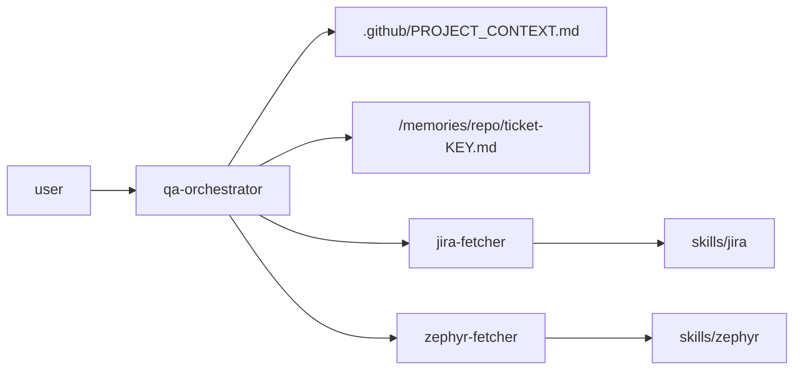

# QA AI Assistant — Drop-in Pack

Portable Copilot/agent customization for QA teams. Copy the `.github/` folder into any project and you get:

- **`/scan-project`** — agent reads the host project and writes [.github/PROJECT_CONTEXT.md](.github/PROJECT_CONTEXT.md), including a `## Repo Setup` section with runtimes, env files, local services, and first-run sequence.
- **`/implement ABC-123`** — fetches Jira + Zephyr, reads sibling-ticket memory, writes tests in the project's own style, then saves a per-ticket memory file.
- **`/generate-test-cases ABC-123`** — proposes Zephyr test cases from acceptance criteria (checks sibling memory to avoid duplicates).
- **`/review-ticket ABC-123`** — read-only ticket + tests + design summary.

## Architecture (one agent per job)



`project-scanner` is a separate agent run on demand to (re)generate the project context.

## Layout

```
.github/
├── copilot-instructions.md      # always-on overview
├── PROJECT_CONTEXT.md           # per-project, generated by scanner
├── agents/                      # one .agent.md per job
├── skills/                      # Jira / Zephyr
└── prompts/                     # slash commands for QA

/memories/
├── repo/ticket-<KEY>.md         # per-ticket memory (scope, files, patterns)
└── session/jira-<KEY>.md        # session cache (cleared each conversation)
```

## What the agent remembers

Every `/implement` run saves a compact record to `/memories/repo/ticket-<KEY>.md`:
- What was done (scope, files touched, patterns used)
- What was deferred

On the **next ticket** in the same epic, the orchestrator automatically reads those sibling memories and reuses naming conventions, mocking patterns, and page-object paths — so you don't have to repeat yourself.

## Jira epic awareness

When `jira-fetcher` reads a ticket it also:
1. Fetches the epic title + status.
2. Finds all sibling tickets under that epic.
3. Flags any siblings that have a memory file — the orchestrator loads those to stay consistent with earlier work.

## Run-verify loop

After implementing, the orchestrator automatically runs the test command from `PROJECT_CONTEXT.md`, reads failures, fixes the code, and re-runs — up to 3 retries. If still failing, it stops and asks for guidance.

## Setup per host project

1. Copy `.github/`, `.vscode/`, and `.env` into the project root.
2. Fill in your credentials in `.env`:
   - **Jira**: `JIRA_BASE_URL`, `JIRA_USER_EMAIL`, `JIRA_API_TOKEN`
   - **Zephyr Scale**: `ZEPHYR_TOKEN`, `ZEPHYR_PROJECT_KEY`
3. Add `.env` to `.gitignore` — never commit real tokens.
4. MCP server config per IDE:
   - **VS Code**: already included in `.vscode/mcp.json`
   - **IntelliJ / JetBrains**: already included in `.junie/mcp.json`
5. Run `/scan-project` once — fills `PROJECT_CONTEXT.md` including the `## Repo Setup` section.
6. Use `/implement <KEY>` for new work. The agent will reuse context from previously implemented tickets in the same epic automatically.
